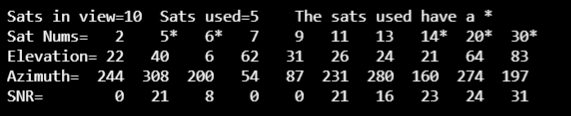

# MyTinyGPS

This code is forked from https://github.com/mikalhart/TinyGPSPlus/tree/master/examples/UsingCustomFields by [Mikal Hart](https://github.com/mikalhart)

Its purpose is to show how parse and use GPGSV and GPGSA to show:
- satellites in view
- if they are used to calculate location (sats in use)
- their azimuth, elevation and SNR

in this way:

See further details on main.cpp

